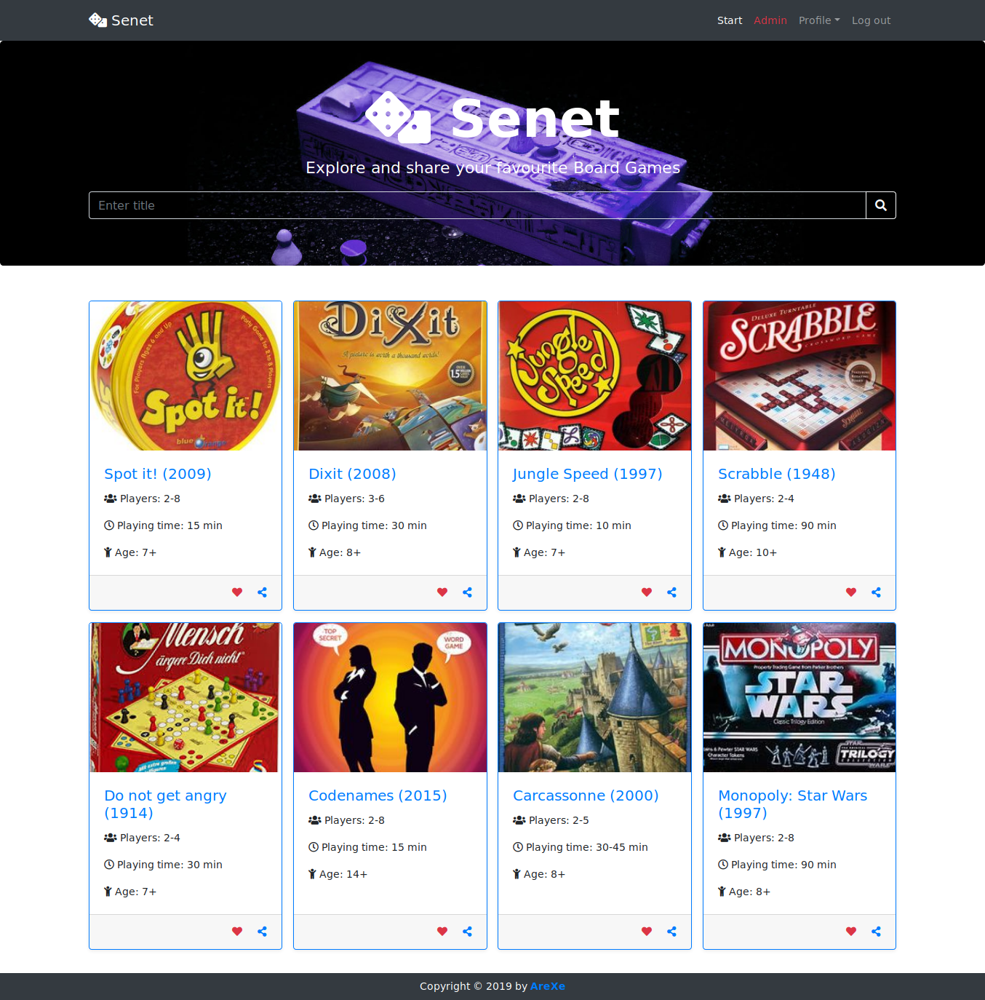

# BoardGames_Spring
[](https://travis-ci.com/AreXe/BoardGames_Spring)

"Senet Board Games" application that provides a possibility for their users to explore, like and share their favourite board games. Project made using Spring technology stack, along with REST API and Bootstrap interface.<br/>
Functionality includes i.a. registering new account, signing in system, updating account info with changing the password, admin panel to control user accounts and board games (CRUD), exploring and sharing board games.

### Stack of technologies
* Spring: Boot, Framework (MVC, DI), Data (Hibernate), Security
* Web: Bootstrap
* Database: PostgreSQL 13+
* Tests: JUnit Jupiter
* CI: Travis

## Live demo
Application is available @ Heroku:
* [Senet Board Games app](https://senetbg.herokuapp.com/)

## Index view of Senet app


## RESTful service usage
Available methods for board games CRUD service:
* `GET` /api/boardgames - return board games list as JSON
* `GET` /api/boardgames/{title} - return board games list by title
* `GET` /api/boardgames/{id} - return board game by given ID
* `POST` /api/boardgames - add new board game (for Admin)
* `PUT` /api/boardgames/{id} - update board game by given ID (for Admin)
* `DELETE` /api/boardgames/{id} - delete board game by given ID (for Admin)

## SOAP Web Service
The application includes simple web service for Board Games repository.
Service specification is defined in WSDL file at:
```
https://senetbg.herokuapp.com/ws/boardgame.wsdl
```
Web Service is located at ``https://senetbg.herokuapp.com/ws/`` and accepts ``POST`` requests with ``Content-Type: text\xml``  
Example SOAP message:
```
<?xml version="1.0" encoding="UTF-8"?>
<soap:Envelope xmlns:soap="http://schemas.xmlsoap.org/soap/envelope/" xmlns:tns="https://senetbg.herokuapp.com/soap/schema">
   <soap:Body>
      <tns:getBoardGameByIdRequest>
         <id>{id}</id>
      </tns:getBoardGameByIdRequest>
   </soap:Body>
</soap:Envelope>
```

## How to run the application
Before starting the application check default configuration available in the `application.properties` file and provide the non-default settings for PostgreSQL database, that can be overridden by environment variables:
```
SPRING_DATASOURCE_URL - JDBC address to database
SPRING_DATASOURCE_USERNAME - databse username
SPRING_DATASOURCE_PASSWORD - database password
```
To start the application you can use the command from Spring Boot Maven Plugin:
```
mvn spring-boot:run
```
### Credentials
Login to admin account using:
* E-mail: admin@gmail.com
* Password: admin

## Spring Boot Actuator
To access additional features to monitor and manage application open `/management` path.
By default, available endpoints exposed with Actuator are: info, health and metrics.